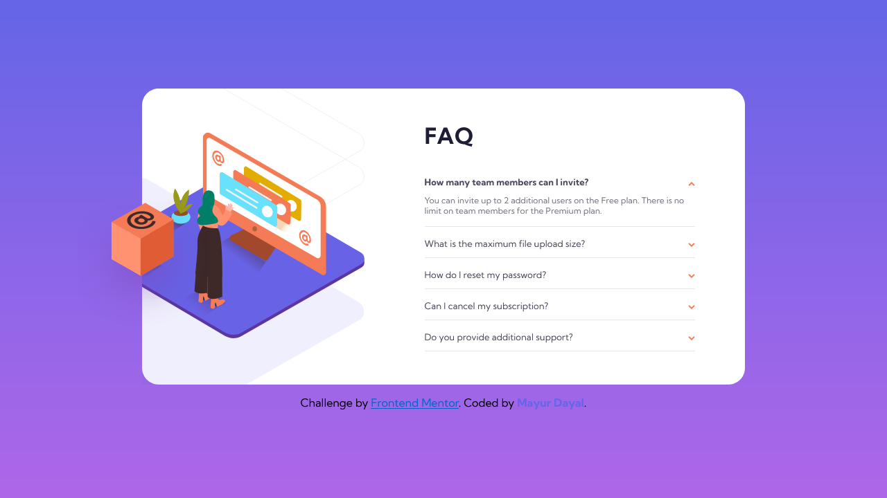

# Frontend Mentor - FAQ accordion card

This is a solution to the [FAQ accordion card challenge on Frontend Mentor](https://www.frontendmentor.io/challenges/faq-accordion-card-XlyjD0Oam). Frontend Mentor challenges help you improve your coding skills by building realistic projects. 

## The challenge

Your challenge is to build out this FAQ accordion card and get it looking as close to the design as possible.

You can use any tools you like to help you complete the challenge. So if you've got something you'd like to practice, feel free to give it a go.

Users should be able to:

- View the optimal layout for the component depending on their device's screen size
- See hover states for all interactive elements on the page
- Hide/Show the answer to a question when the question is clicked

**To do this challenge, you need a basic understanding of HTML, CSS and JavaScript.**

## Screenshot

### Mobile Screenshot

### Desktop Screenshot

### Active states

## Links

- Solution URL: [https://github.com/mayurDayal2000/faq-accordion-card-main](https://github.com/mayurDayal2000/faq-accordion-card-main)
- Live Site URL: [Add live site URL here](https://your-live-site-url.com)

## Built with

- Semantic HTML5 markup
- CSS custom properties
- Flexbox
- CSS Grid
- Mobile-first workflow
- JavaScript function expression
- JavaScript Loops and Events

## Author

- Frontend Mentor - [@mayurDayal2000](https://www.frontendmentor.io/profile/mayurDayal2000)
- Twitter - [@mayur_dayal_5k](https://twitter.com/mayur_dayal_5k)